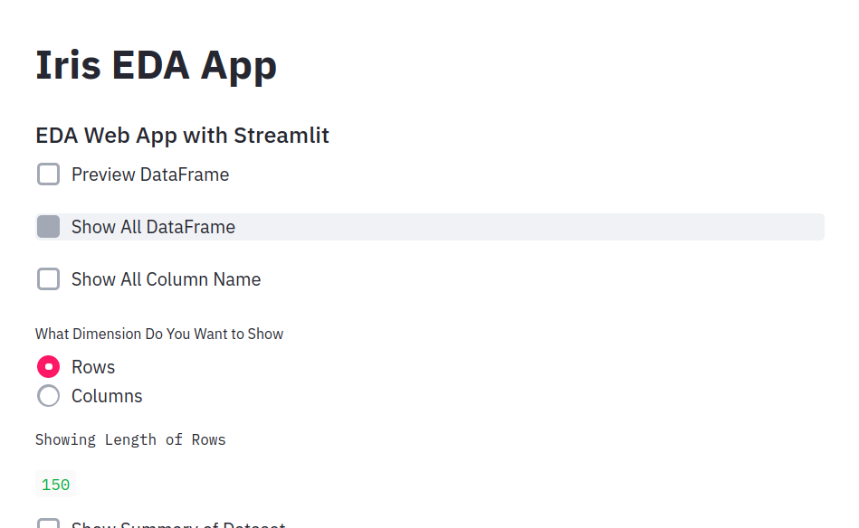
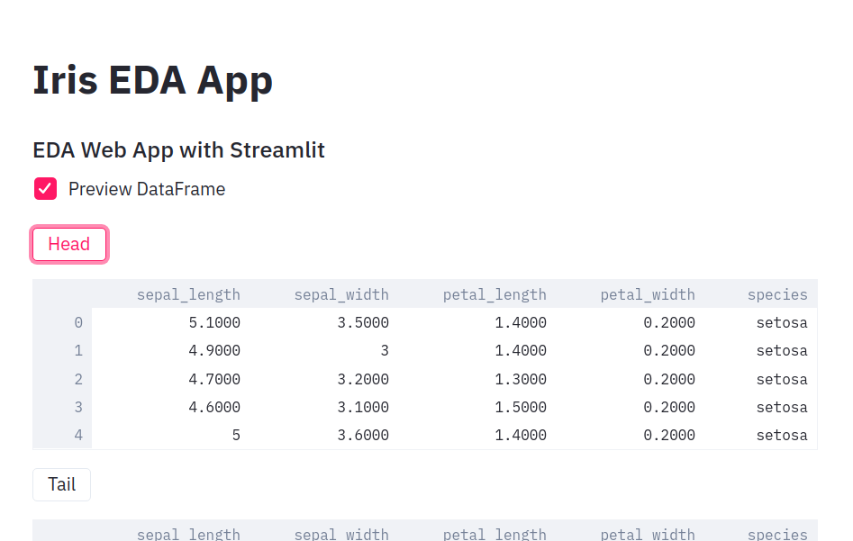
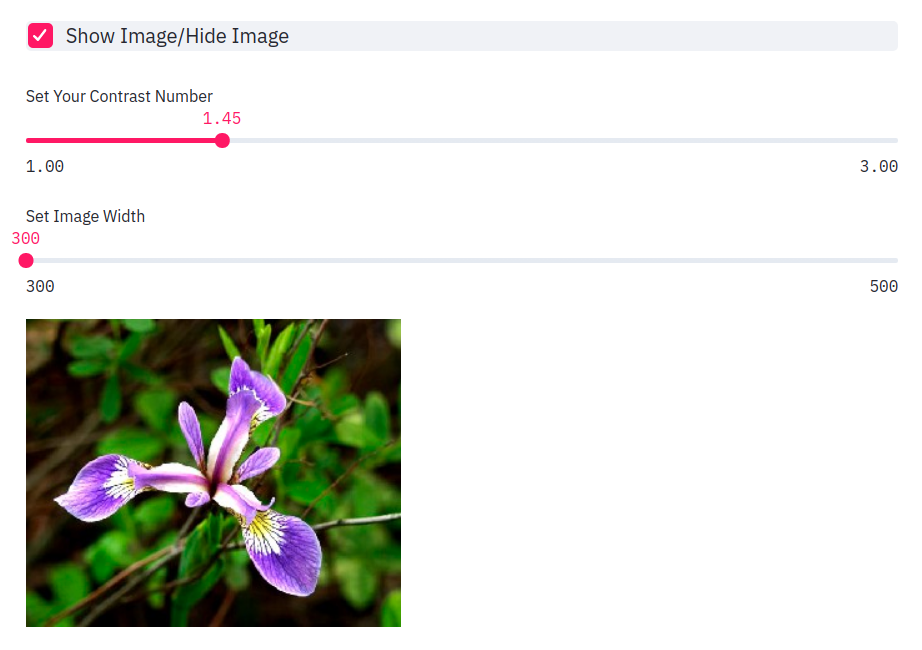
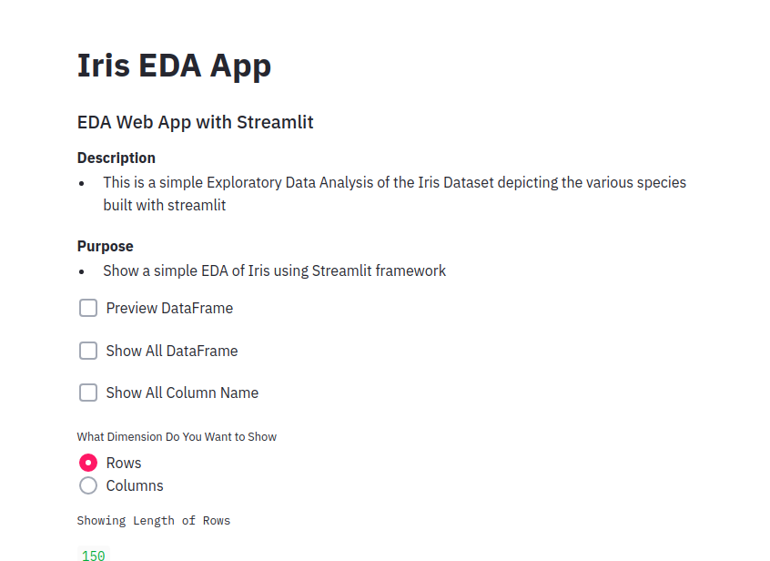

### Iris EDA Web App

An interactive Exploratory Data Analysis application built with Streamlit for the classic Iris dataset.

#### Description
This application provides a comprehensive EDA interface for the Iris dataset, showcasing various Streamlit components and visualization techniques. It demonstrates different iris species with interactive controls and multiple visualization options.

#### Features
- 📊 Interactive data preview with head/tail display
- 🔢 Dataset statistics and summary
- 📈 Multiple visualization types:
  - Bar plots with Matplotlib
  - Correlation matrices (Matplotlib & Seaborn)
  - Custom grouped bar charts
- 🖼️ Species image gallery with three iris varieties
- 🎨 Image manipulation with adjustable contrast and width
- 🎯 Column selection and data filtering

#### Purpose
To demonstrate a complete EDA workflow using Streamlit's modern API and showcase best practices for interactive data analysis applications.

#### Requirements
```bash
streamlit>=1.39.0
pandas>=2.2.0
numpy>=1.26.0
matplotlib>=3.9.0
seaborn>=0.13.0
Pillow>=10.4.0
```

#### Installation
```bash
pip install -r requirements.txt
```

#### Running the App
Navigate to the app directory and run:

```bash
streamlit run app.py
```

Or use the alternative version:

```bash
streamlit run iris_app.py
```

#### Screenshots

##### Dataset Preview


##### Show DataFrame/Columns


##### Show and Hide Image


##### With Description


#### Dataset
The Iris dataset contains 150 samples of iris flowers with measurements of:
- Sepal length
- Sepal width
- Petal length
- Petal width
- Species (Setosa, Versicolor, Virginica)

#### Technical Details
- Uses `@st.cache_data` for efficient data loading
- Implements modern Matplotlib/Seaborn integration with Streamlit
- Demonstrates proper figure object handling for plots
- Includes PIL for image enhancement features

#### Created By
**Sazzad Hussain Farhaan**

#### Acknowledgments
Thanks to the Streamlit team for their amazing framework!

---
*Updated with latest Streamlit APIs and best practices*